---
author:
- Admin
categories:
- Working days
date: "2020-03-14T15:40:24+06:00"
description: This is meta description
draft: false
image: images/image-20201210135159404.png
tags:
- work
- day
weight: 1
title: 雪华德国随记：厨余堆肥仍占据“半壁江山”
---
### 雪华德国随记：厨余堆肥仍占据“半壁江山”

##### 研究院首席科学家张雪华研究员德国哥廷根市垃圾管理公司参访记录

项目小组按：德国在履行各类国际条约以促进生物多样性、减少温室气体排放、资源回收、使用可再生能源、支持全球性永续发展等方面都处于领先地位。德国自90年代初开始重视垃圾分类和资源化利用，经过多年的政策引导和技术开发，在垃圾焚烧产能回收和可回收资源利用方面都取得了长足进步。最近十几年来尤其重视家庭有机废弃物（德国称为bio-waste），也就是我们提倡的家庭厨余和园林垃圾的源头分类，目前全德国范围内已经实现50%左右的分类率，部分城市（如哥廷根市）甚至达到70-80%的厨余分类率。厨余资源化利用方面，以堆肥和各种厌氧消化技术为主，其中厨余堆肥经过近三十年的发展，目前已建成将近1000个堆肥厂，规模最大的全机械式好氧堆肥厂日处理量达800吨。BGK发布的《Activity report 2019》称，目前德国53%的堆肥厂只处理园林垃圾，另外47%的堆肥厂将单独收集的家庭有机废弃物（通常含有生物蛋白）与园林垃圾混合用于堆肥。另外，德国政府提倡家庭开展厨余堆肥，免交厨余收运费，所以目前德国也有一百多万家庭在自行堆肥。

2019年7月8日，研究院首席科学家张雪华博士受邀德国哥廷根大学讲学，并参观访问了德国哥廷根市郊已经运行25年的Dransfeld垃圾处理厂的堆肥设施，处理厂由当地的Landkreis公司管理，是公共性质的机构（public company）。公司经理Dirk Piper先生热情接待。让我们跟随雪华博士的脚步，一起去看看哥廷根市如何实现厨余垃圾分类和资源化利用。

（雪华博士备注**：**Piper先生非常谦逊，一见面就向我致歉：“我的英文不好，讲不清楚的地方，请多包涵！”虽然他的英文其实还不错，但参访期间确实出现了好几次我们得靠手机查德文对应的英文单字的时候，所以这篇推文如有信息不准确的地方，欢迎读者指正。)

##### 跟随雪华博士的脚步打开资源化利用的大门

哥廷根市是德国最早开始厨余分类的城市，其垃圾分类主要依靠居民的配合, 在生活垃圾的发源地—居民家中实现。在专业人员的指导下, 居民根据不同成分垃圾的利用及处理途径,对其进行科学分类收集。其中，绿桶是收集有机垃圾的，按桶的大小每年收费。值得指出的是，垃圾管理公司实际承担起了本应该由政府执行的监督居民分类的职责，公司上门收集垃圾时若发现居民没有分类，会对其进行持续两次的劝说，到第三次还没有分类，公司就直接将绿色有机垃圾桶换成黑色混合垃圾桶。黑桶每年的垃圾收运费比绿桶几乎贵一倍，这意味着不进行垃圾分类就要支付高昂的垃圾费，举例来说，一个4口之家，每年需要缴纳大约90欧元的有机垃圾处理费（绿桶），混合垃圾则是150欧元（黑桶）。同时，厨余收集过程中，公司也会通过机器透视检测是否混有金属，发现就拒收，连续三次出现这种情况，公司就会换桶。即便如此，不少居民宁愿多交费也不愿进行分类。据了解，这种宁愿多交费也不分类的情况在整个德国仍然很普遍，这也是德国的厨余分类率徘徊于50%左右的主要原因。在哥廷根市，目前大约有70-80%的居民进行厨余分类。

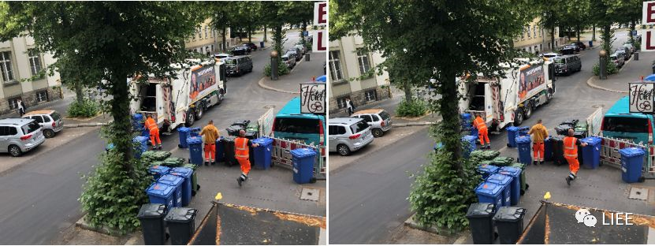

哥廷根市目前有两个堆肥设施，位于两个垃圾处理厂内，主要是处理哥廷根市周边的垃圾。每个堆肥设施每年能够处理8000吨有机废弃物（平均每天22吨），分别距离市区15公里和40公里。张雪华博士参观的Dransfeld垃圾处理厂的堆肥设施距离市区15公里，主要处理周围居民（大约3万居民）的厨余、园林垃圾和少量农业废弃物。负责处理哥廷根市区厨余的堆肥厂前两年被烧毁，新的堆肥厂正在筹建中。

 Dransfeld是一个综合性的垃圾处理厂（图中屋顶红白相间的建筑），主要区域划分为二次分拣设施、堆肥区域、一个小型填埋场，张雪华博士参观的主要是堆肥区域。整个垃圾处理厂主要靠上门收集垃圾、接收周边送来的园林垃圾和出售成熟肥维持处理厂的日常运行，现有六个全职员工，管理收运、分拣垃圾、堆肥、填埋和其他相关工作。

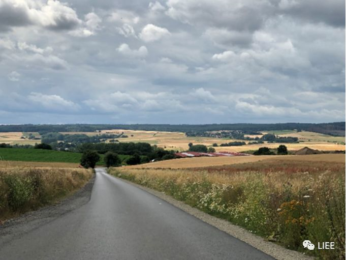

管理厂大门进来就是称重区域，车辆一进一出能够测算出卸载的有机垃圾量，卸料后出厂时付费，主要是附近居民夏天自己运送过来的园林垃圾。

由于参观的时候正在翻堆，厂区内能闻到轻微的酸腐味，但并不是传统厌氧发酵的臭味。走近堆体，发现两个新鲜的堆体上面（分别是1周和2天）少量苍蝇起起落落，堆体内不断向外散发热气，Piper先生介绍说堆体冬天也能正常升温；堆体仅有少量的渗滤液，旁边修建的窄窄的渗滤液收集池很少装满。现场还看见厂区内、堆体上方一直有好些鸟儿盘旋，显示厂区的生态环境良好。堆肥厂采用最基本的条垛式堆肥，分为厨余加园林垃圾混合堆肥、树枝树干打碎单独堆肥两种堆肥方式，均不额外添加干物质和菌种，5~7天堆满一条，每周机器翻堆一次，同时喷洒厂区内雨水收集池收集到的雨水来调节堆体湿度，大约12周左右获得成熟肥。家庭厨余每两周上门收一次（夏季一般一周一次），因而堆肥厂不是每天都要处理厨余。Dransfeld堆肥设施隔一周堆一个条垛。

堆肥厂采用最基本的条垛式堆肥，分为厨余加园林垃圾混合堆肥、树枝树干打碎单独堆肥两种堆肥方式，均不额外添加干物质和菌种，5~7天堆满一条，每周机器翻堆一次，同时喷洒厂区内雨水收集池收集到的雨水来调节堆体湿度，大约12周左右获得成熟肥。家庭厨余每两周上门收一次（夏季一般一周一次），因而堆肥厂不是每天都要处理厨余。Dransfeld堆肥设施隔一周堆一个条垛。

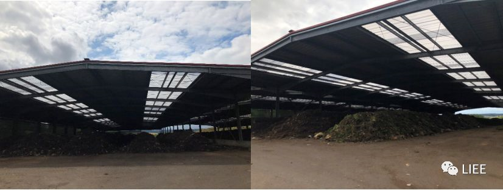

堆肥管理只监测温度，按照要求需要达到55℃摄氏度以上，持续至少5天，同时观察湿度，不检测碳氮比。厨余混合园林垃圾和纯园林垃圾两种原料堆出来的成熟肥质量都能达到德国有机肥标准，厨余混合园林垃圾的堆肥因氮含量高，肥质更好。

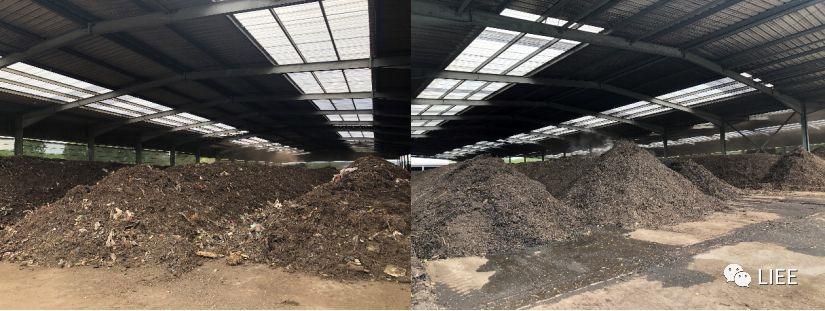

堆肥区域内摆放有一台筛选机和一台翻堆机，由于翻堆机价格昂贵，目前公司下属的两个堆肥设施轮换共用一台。筛选机里有三种不同尺寸孔隙的过滤桶，能够筛出不同颗粒大小的成熟肥，供不同的用途。

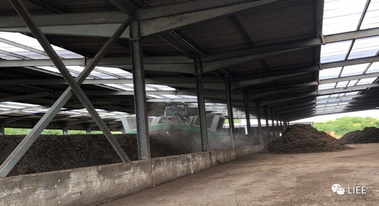

成熟肥需要经过至少两道筛选，最大许可是50mm直径的大颗粒，其次是10-20mm直径的小颗粒，树枝树干堆肥第一次筛出来的大颗粒可以用于居民花园覆土保湿；厨余加园林堆肥因为混有未完全降解的塑料，需要进行二次筛分。

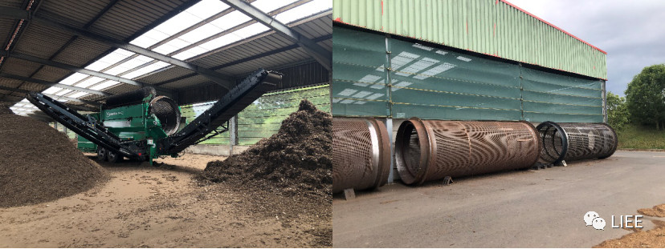

用来装厨余的可降解生物（有些称为“可堆肥”）塑料袋，因需要180天工业堆肥才能真正降解，无法实现和厨余堆肥同步降解，最后只有进一步筛选出来。Pipe先生说他们希望居民能够尽量少用这样的“可堆肥”塑料袋，改用纸袋更有利于实际堆肥管理。

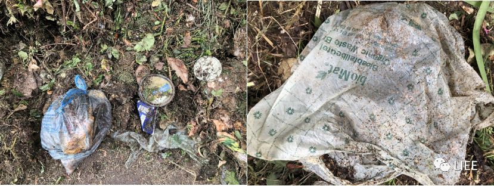

Dransfeld堆肥设施已经运行25年，是欧洲堆肥联盟的成员，产品通过了堆肥资质认证，附近的农民和居民都愿意购买其成熟肥产品。一般来说，农民愿意用大颗粒成熟肥，居民更愿意用小颗粒成熟肥；冬天购买量较少，夏天因种植和园林需求而购买量大增，所以拜访现场时看到的库存成熟肥不多。

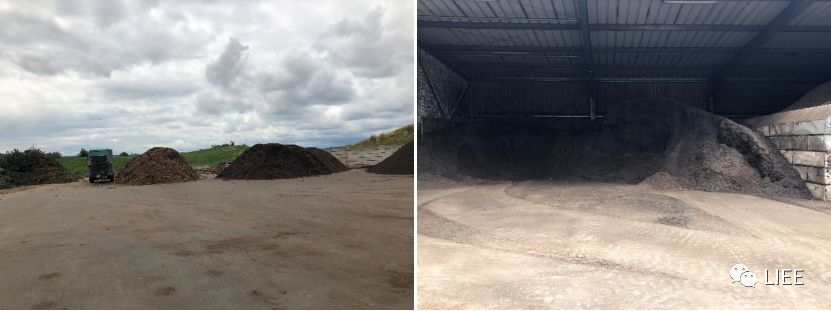

Dransfeld出售两种性质的堆肥产品，一种相当于有机肥, 需要与土壤混合才能用于种植，这与堆肥没有添加干物质有关，都是纯厨余+绿色园林垃圾这样含氮高的物质；一种相当于堆肥土，事先已经和土壤混合均匀，消费者买回去可以直接用于种植。

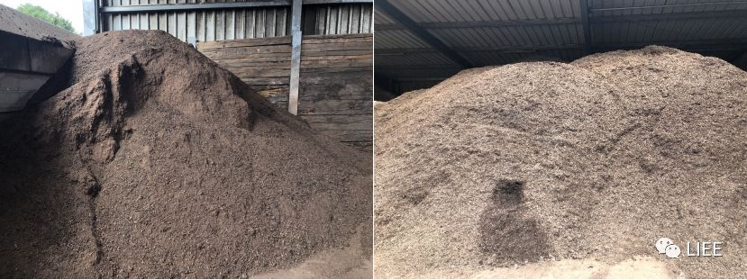

堆肥产品因其营养丰富、有机质含量高等特性，在德国许多领域得到广泛的应用。2018年的德国堆肥市场分布情况如下图所示：大多数堆肥产品(58.4%)用作农业有机肥料和土壤改良剂，特别是有机农业对堆肥的需求越来越大。欧洲土壤有机质的减少以及土壤侵蚀引起的退化越来越重要，利用优质堆肥中稳定的有机质来改善土壤性质，被看作是解决这些问题的有效途径。

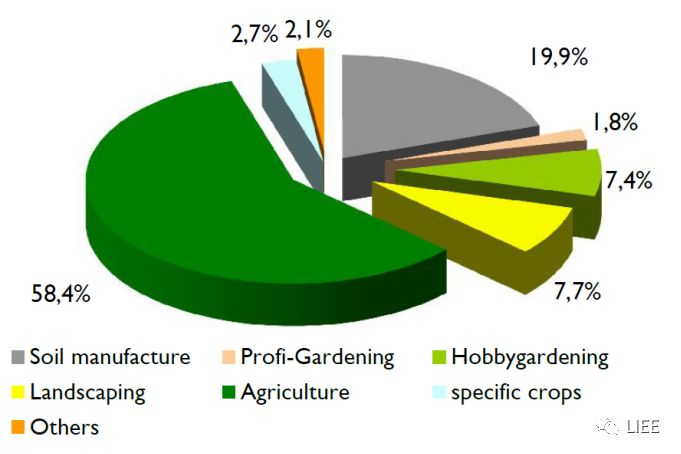

另外，如前言所说，德国允许家庭堆肥，这些家庭没有使用有机垃圾分类桶，也就不用缴纳有机垃圾收运费，具体如何执行，各城市不尽相同。在哥廷根，家庭自己堆肥需要经过Landkreis公司的认可，需要采用规范的堆肥方法，不允许居民直接在地上堆肥或者是挖坑埋起来。居民也可以选择同时使用有机垃圾分类桶和自己堆肥（一般是部分厨余）。

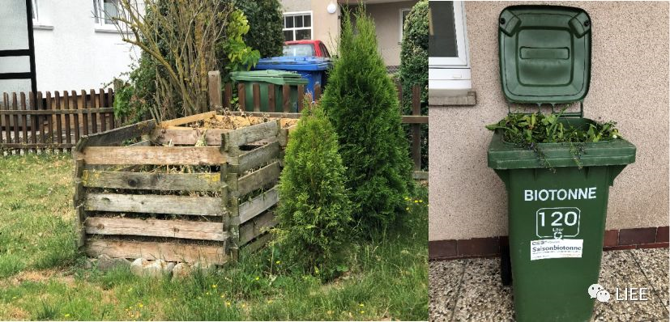

BGK发布的《2019年活动报告》显示了自2000年以来，堆肥厂和沼气厂的发展情况。由下图可见2018年用于堆肥的有机废物总量为746万吨，对于556个堆肥厂来说，这意味着平均每年可以生产13.400吨堆肥产品；170家沼气厂处理534万吨有机废物，每家沼气厂的年均吞吐能力为31.400吨有机废弃物。

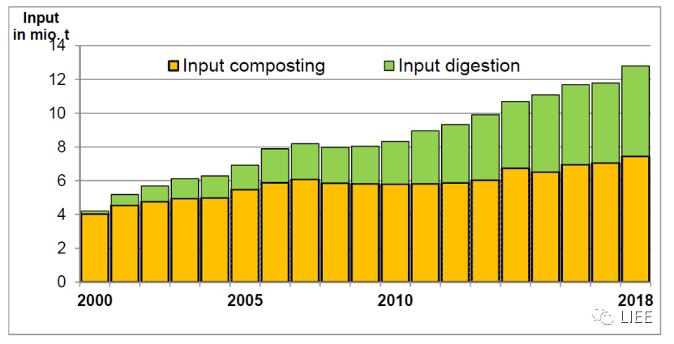

近年来，垃圾分类在我国各地如火如荼地开展，但居民源头分类率很低，垃圾混收混运的现象十分普遍，后续垃圾的处置仍然面临巨大的压力。如何构建后端处置和再利用产业链，尤其是如何将占垃圾比例高达50%以上的厨余垃圾分拣出来并实现资源化利用，已成为当下快速推进垃圾分类工作亟待解决的的重要课题。如果德国及哥廷根市的模式能够给大家的思考和实践提供一点启发，这篇推文也便写有所值了。

**关于我们**

南京大学（溧水）生态环境研究院是南京大学与南京市溧水区人民政府共同创办的独立法人事业单位，是社会公益性环境保护科学研究机构，主要从事具有引领性、创新性、基础性生态环境保护科学研究和成果应用转化。 研究院旨在打造国内领先、国际一流的“环境科技创新平台、高端环保人才聚集平台、环保科研成果转化平台、国际交流与合作平台”。自成立以来，研究院在有机固废资源化技术与装备、绿色产品生命周期设计与评价、环境大数据平台技术、大气环境研究等方向取得一系列原创性成果。研究院网址：http://www.njuliee.com。

